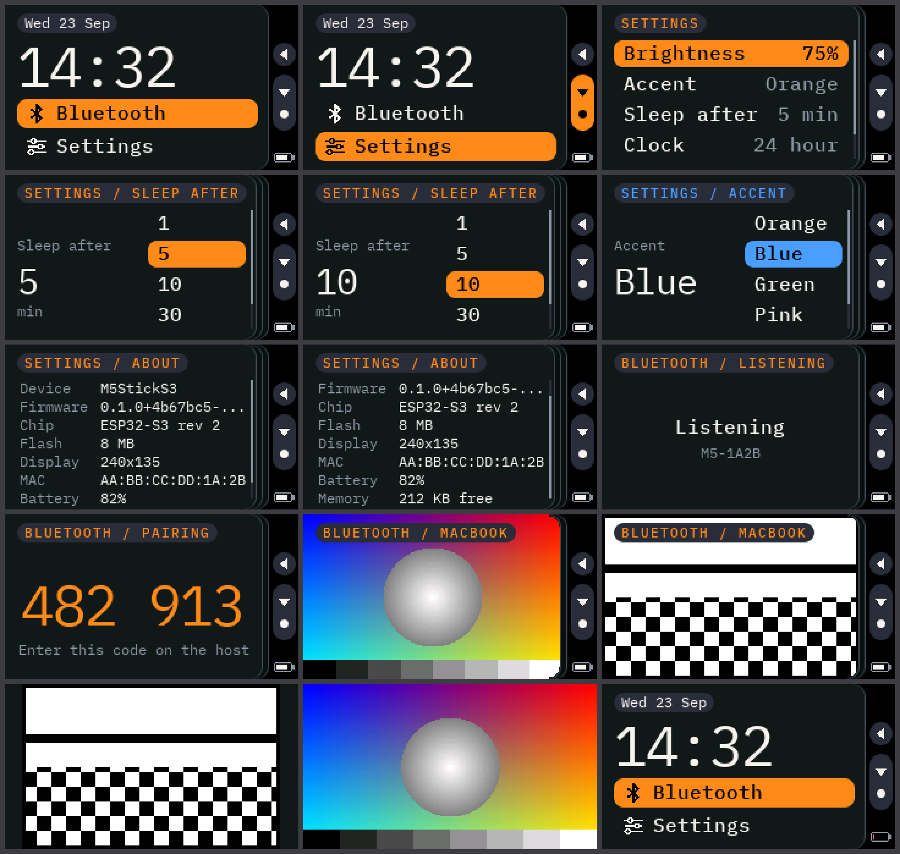

# m5stack-platformio

The [Xteink X4 shell](../xteink-x4-platformio/) on an M5StickS3: the same home
screen (date, clock, apps), Bluetooth remote screen and Settings, redrawn for a
240 × 135 colour LCD and two keys. It's a [blit](../blit/) display and a
[blat](../blat/) device through the same shared libraries as the X4.



Those are rendered from the firmware's own drawing code on a computer (see
[Screens without a device](#screens-without-a-device)).

**Status: builds, not yet run on hardware.** Everything above the board layer
is exercised by the renderer; the parts only a device can check are listed
under [Status / next](#status--next).

## Hardware

- **M5StickS3**: ESP32-S3-PICO-1-N8R8 (8MB flash, 8MB PSRAM), 1.14" 135 × 240
  ST7789 LCD, two keys, M5PM1 power chip. Board support is
  [M5Unified](https://github.com/m5stack/M5Unified), which detects it.
- Held in landscape with the front key on the right of the screen
  (`layout::kRotation` in [`src/shell/Layout.h`](src/shell/Layout.h) if it comes
  up upside down).

Two keys drive everything. The gutter beside the screen shows them, centred:
a circle for the top key and, under it, a tall bar for the front key.

| Key | Press | Double press |
| --- | --- | --- |
| Front key (A) | **Next**: down a row; lists wrap round | **Select** / Open |
| Top key (B) | **Back** one page; from an app's top level, home | Show / hide chrome: the gutter and titles |

A single press acts once the time for a second press has passed, so both keys
answer a beat after the press. There's no Up.

The mapping lives only in [`src/shell/Input.cpp`](src/shell/Input.cpp).

## What's different from the X4

| | X4 | StickS3 |
| --- | --- | --- |
| Screen | 800 × 480, 1-bit e-paper | 240 × 135, 16-bit colour LCD: dark theme, an accent colour for the selected row |
| Drawing | FreeInk `GfxRenderer`, fast / half refreshes | one M5GFX sprite pushed whole; no refresh policy, real slide animations |
| Type | Plex Mono 15 / 22 / 136, 1-bit | Plex Mono 11 / 12 / 16 / 30 / 46, antialiased (VLW) |
| Keys | four front keys + side key | two keys: Next / Select (double press) and Back |
| Apps | Images, Bluetooth, Settings | Bluetooth, Settings (no SD card, so no Images and no saved frames) |
| blit formats | `mono1`, `gray2` | `rgb565` first, then `gray4`, `gray2`, `mono1` |
| Settings | Refresh, Sleep after, Clock, Frame sleep | Brightness, Accent, Sleep after, Clock |
| Clock | BM8563 RTC | the system clock: lost at power-off, kept through sleep |
| Sleep | page stays on the e-paper | screen off; the front key wakes it (a restart). Never on USB power |

## Toolchain

[PlatformIO](https://platformio.org/) (`pio`), the same pioarduino platform as
the X4. Dependencies are downloaded on the first build.

```sh
pio run                     # build
pio run -t upload           # flash (replaces whatever is on the stick)
pio device monitor          # serial log (115200)
```

Driving it from the Mac over USB (needs `pyserial`; `shot` needs Pillow):

```sh
python3 scripts/devctl.py time                   # set the clock to the Mac's local time
python3 scripts/devctl.py shot shot.png          # screenshot
python3 scripts/devctl.py key select down back   # inject key actions (back/select/up/down/chrome)
python3 scripts/devctl.py status
```

The clock shows `--:--` until it has been set, which is after every power-off.

## Screens without a device

```sh
scripts/sim.sh              # needs SDL2 (brew install sdl2) and Pillow
```

builds the shell, widgets and apps for this computer (`pio run -e sim`), with
the board and the radio stubbed ([`sim/`](sim/)), walks through the screens and
writes them to `docs/screens/`. The Bluetooth frames in it go through the real
blit `Receiver`, as a host would send them. Run it after changing anything
visual.

## Bluetooth

As on the X4: the **Bluetooth** app advertises as `M5-XXXX` while it's open,
shows the frames a [blit](../blit/PROTOCOL.md) host sends, and serves the
settings in [`src/Controls.h`](src/Controls.h) over
[blat](../blat/PROTOCOL.md), with a six-digit pairing code on screen for a new
host. Send from the [blit web demo](../blit/web/) or the
[Chrome extension](../blit/chrome-extension/); change settings from
[`blat/server`](../blat/server/).

- The frame area is 211 × 135 with chrome, 240 × 135 without; toggling chrome
  tells the host the new size.
- A sends Down, or Select on a double press. B still leaves the app.
- No `persist`, no frame sleep (a sleeping LCD shows nothing).

## Layout

```
src/
  main.cpp            boot, main loop, idle sleep, serial commands
  Controls.h          every setting, declared once (device UI and blat)
  Settings.*          their values, in NVS
  Theme.h             colours, accent
  Fonts.*, fonts/     Plex Mono as VLW (scripts/fonts.sh regenerates)
  hal/Board.*         M5Unified: panel, backlight, clock, battery, sleep
  shell/              Layout, Input (keys → Actions), App interface, Shell
  ui/Widgets.*        pills, rows, ListView, InfoView, icons
  apps/               BleApp, SettingsApp
  ble/                Cast (blit display), Remote (blat device), Radio (NimBLE)
sim/                  stand-ins for hal/ and ble/, and the screen walk-through
scripts/              devctl.py, sim.sh, fonts.sh, vlwfont.py
```

To add an app, subclass `App`, then `shell.addApp(&myApp)` in `main.cpp` (and
`sim/main.cpp`).

## Status / next

- [x] Builds for the StickS3 (about 1 MB)
- [x] Home, Settings, Bluetooth, rendered and checked in the simulator
- [x] blit frames in `rgb565` and the grey formats, through the real receiver
- [ ] First run on hardware. To check there: screen rotation and which way
      round the keys sit beside the gutter; how the double press feels;
      battery, charging and USB readings; waking from sleep with the
      front key; a real blit and blat session
- [ ] Set the clock over blat (`time.now`), so it doesn't need the serial port
- [ ] Something for the IMU, speaker and microphone to do
